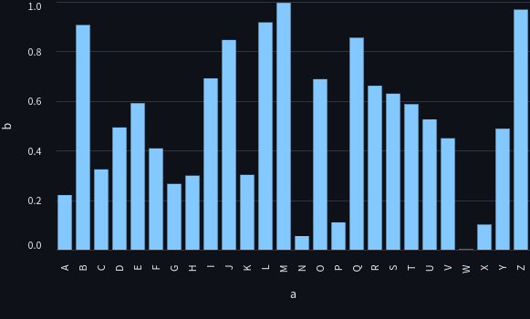
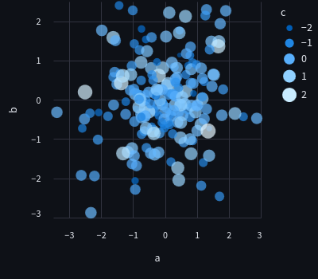
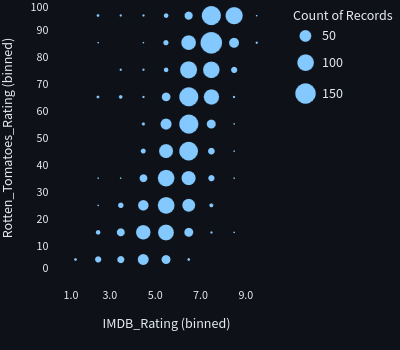

<div class="grid cards" markdown>

-   #### [Simple Bar Chart](https://altair-viz.github.io/gallery/simple_bar_chart.html)

    ---

    === "Basic"

        <figure></figure>

        ```py
        --8<-- "includes/py/altair/simple-bar-chart.py"
        ```

-   #### [2D Histogram Scatter Plot](https://altair-viz.github.io/gallery/histogram_scatterplot.html)

    ---

    === "Basic"

        <figure></figure>

        ```py
        --8<-- "includes/py/altair/mark_circle.py"
        ```

    === "Movies"

        <figure></figure>


        ```py
        --8<-- "includes/py/altair/mark_circle-movies.py"
        ```


</div>
