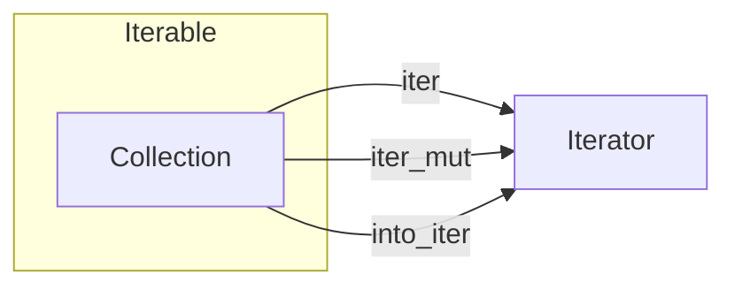

An iterator is any value that implements std::[iter][std::iter]::[Iterator](https://doc.rust-lang.org/stable/std/iter/trait.Iterator.html)

There are [three common ways](https://doc.rust-lang.org/stable/std/iter/index.html#the-three-forms-of-iteration) of creating iterators from collections:

- **iter()** iterates over &T
- **iter\_mut()** iterates over &mut T
- **into\_iter()** iterates over T


Any value that implements [IntoIterator](https://doc.rust-lang.org/stable/std/iter/trait.IntoIterator.html) and the method **into\_iter** is **iterable**.

Under the hood, every **for** loop is syntactic sugar for calls to IntoIterator and Iterator methods.
Here, the for loop uses IntoIterator::into\_iter to convert the operand &v into an iterator and then calls Iterator::next until the operand is exhausted.

```rs
let v = vec!["antimony", "arsenic", "aluminum", "selenium"];
```

<div class="grid cards" markdown>

```rs
for element in &v {
    println!("{}", element);
}
```

```rs
let mut iterator = (&v).into_iter();
while let Some(element) = iterator.next() {
    println!("{}", element);
}
```
</div>


For example, a [RangeInclusive](https://doc.rust-lang.org/stable/std/ops/struct.RangeInclusive.html) value is an iterator

Triangle number

<div class="grid cards" markdown>


```rs
--8<-- "includes/rs/triangle-number/triangle-number-naive/src/lib.rs"
```

```rs
--8<-- "includes/rs/triangle-number/triangle-number-fold/src/lib.rs"
```

</div>

Methods that call next are referred to as **consuming adaptors**.

=== "collect"

    An iterator can be converted into a collection using [**collect**](https://doc.rust-lang.org/stable/std/iter/trait.Iterator.html#method.collect).


=== "chain"

    An iterator can be concatenated to another by using the [**chain** method](https://doc.rust-lang.org/stable/std/iter/trait.Iterator.html#method.chain).

    